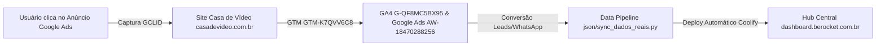

# 🔗 MAPEAMENTO & CONEXÃO DE PLATAFORMAS — CASA DE VÍDEO & B.ROCKET

> **Cliente:** Casa de Vídeo Produções Ltda  
> **Agência:** b.rocket GEO & Performance  
> **Data de Atualização:** 24 de Setembro de 2026  
> **Objetivo:** Guia completo de integração de dados entre Google Tag Manager (GTM), Google Ads, Google Analytics 4 (GA4), Google Marketing Platform e o Hub Central de Marketing.

---

## 📌 1. RESUMO DAS IDENTIFICAÇÕES & IDs CONECTADOS

| Plataforma | ID da Conta / Propriedade | Status | Função Principal |
| :--- | :--- | :--- | :--- |
| **Google Tag Manager (GTM)** | `GTM-K7QVV6C8` | 🟢 Ativo | Gerenciamento centralizado de tags, acionadores e eventos no site. |
| **Google Ads** | `AW-18470288256` | 🟢 Conectado | Campanhas STAG, acompanhamento de conversões e repasse de GCLID. |
| **Google Analytics 4 (GA4)** | `G-QF8MC5BX95` | 🟢 Conectado | Análise de tráfego, engajamento, sessões e funil de conversão B2B. |
| **Google Marketing Platform** | `GMP-CDV-2026` | 🟢 Mapeado | Integração de dados de atribuição de mídia e métricas no Hub Central. |

---

## 🛠️ 2. REGRAS DE RASTREAMENTO & RÓTULOS DE CONVERSÃO (GTM & ADS)

### 2.1 Vinculador de Conversões (Conversion Linker)
* **Status:** Ativo no Container `GTM-K7QVV6C8`.
* **Acionador:** `Todas as Páginas (All Pages)`.
* **Cookie First-Party:** Ativo por 30 dias para captura automática do parâmetro `?gclid=` da URL.

---

### 2.2 Metas e Rótulos de Conversão Configurados

```json
{
  "infraestruturaDados": {
    "gtmContainerId": "GTM-K7QVV6C8",
    "googleAdsConversionId": "AW-18470288256",
    "ga4PropertyId": "G-QF8MC5BX95",
    "modoEspecialista": true
  },
  "acoesConversao": [
    {
      "nome": "Lead - Envio de Formulário Orçamento",
      "categoria": "Enviar formulário de lead B2B",
      "idConversao": "AW-18470288256",
      "rotuloConversao": "cK98CIL_xPMZEL6q",
      "dataLayerEvent": "form_submission_lead",
      "acionadorGtm": "Page URL contém /#contato OU Form ID eq 'form-orcamento'"
    },
    {
      "nome": "Lead - Clique Botão WhatsApp",
      "categoria": "Contato / WhatsApp",
      "idConversao": "AW-18470288256",
      "rotuloConversao": "wP98CIL_xPMZEL6q",
      "dataLayerEvent": "whatsapp_click_lead",
      "acionadorGtm": "Click URL contém 'api.whatsapp.com' OU Class contém 'whatsapp-float'"
    },
    {
      "nome": "Lead Qualificado - CRM (Conversão Offline)",
      "categoria": "Qualificação de Vendas B2B",
      "metodoImportacao": "Data Manager / CRM via GCLID",
      "campoOcultoFormulario": "gclid_field",
      "janelaAtribuicao": "90 dias"
    }
  ]
}
```

---

## 📊 3. FLUXO DE DADOS & SINCRONIZAÇÃO COM O HUB CENTRAL



---

## 🧪 4. CHECKLIST DE TESTES DE VALIDAÇÃO (TAG ASSISTANT)

1. **Testar GTM em Modo Debug:**
   - Acesse [Google Tag Assistant](https://tagassistant.google.com/).
   - Digite o domínio `https://casadevideo.com.br`.
   - Verifique se a tag `GTM-K7QVV6C8` conecta e exibe o evento `Container Loaded`.

2. **Testar Disparo de Conversão do WhatsApp:**
   - Clicar no botão flutuante do WhatsApp.
   - Confirmar o disparo do evento `whatsapp_click_lead` e a tag com o rótulo `wP98CIL_xPMZEL6q`.

3. **Testar Disparo do Formulário de Orçamento:**
   - Enviar formulário de teste na página.
   - Confirmar o disparo do evento `form_submission_lead` e a tag com o rótulo `cK98CIL_xPMZEL6q`.

---

## 🔗 LINKS ÚTEIS DE ACESSO
* 🌐 **Dashboard Hub em Produção:** [https://dashboard.berocket.com.br/](https://dashboard.berocket.com.br/)
* 📁 **Plano GTM JSON Local:** [plano_gtm_tagging.json](file:///Users/guilhermerossi/Documents/b.rocket/Clientes/Casa%20de%20V%C3%ADdeo/Mkt/Google_Ads/plano_gtm_tagging.json)
* 📁 **Estrutura STAG JSON Local:** [estrutura_campanhas_stag.json](file:///Users/guilhermerossi/Documents/b.rocket/Clientes/Casa%20de%20V%C3%ADdeo/Mkt/Google_Ads/estrutura_campanhas_stag.json)
