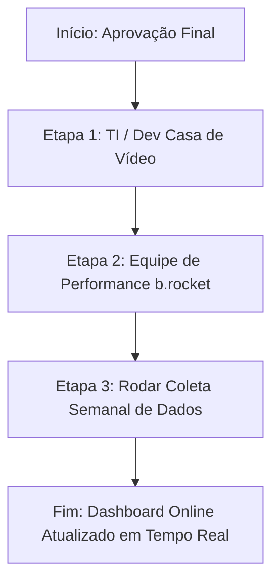

# 🚀 PLANO DE EXECUÇÃO E CONTINUIDADE EM PRODUÇÃO — CASA DE VÍDEO & B.ROCKET

> **Data de Atualização:** 23 de Setembro de 2026  
> **Cliente:** Casa de Vídeo  
> **Agência:** b.rocket GEO & Performance  
> **Objetivo:** Guia passo a passo auto-contido para colocar em execução real a operação de Marketing Digital, GEO (Generative Engine Optimization), SEO On-Page e Mídia de Performance (Google Ads STAG).

---

## 📌 1. STATUS ATUAL DA OPERAÇÃO & ESTRUTURA CRIADA

Toda a infraestrutura visual, lógica e de persistência de dados foi concluída e está **publicada online**:

- 🌐 **URL Oficial do Dashboard Hub:** [https://dashboard.berocket.com.br/](https://dashboard.berocket.com.br/) *(Redireciona para o login se não autenticado)*
- 🔒 **Credenciais de Acesso (Cliente & Agência):**
  - **Usuário:** `casadevideo`
  - **Senha:** `cdv2026@rocket`
- 📁 **Repositório GitHub:** `https://github.com/agencia-berocket/cdv.git`
- ⚡ **Servidor / PaaS (Coolify):** App `Casa de Video` (`gdjf1tnq7levuy2npetakjs8`)
- 💾 **Persistência de Dados Históricos:** [historico_semanal.json](file:///Users/guilhermerossi/Documents/b.rocket/Clientes/Casa%20de%20V%C3%ADdeo/Mkt/data/historico_semanal.json) com script [sync_dados_reais.py](file:///Users/guilhermerossi/Documents/b.rocket/Clientes/Casa%20de%20V%C3%ADdeo/Mkt/data/sync_dados_reais.py)

---

## 📋 2. PASSO A PASSO PARA ENTRADA EM PRODUÇÃO REAL

Para que o site oficial da Casa de Vídeo (`https://casadevideo.com.br`) passe a gerar resultados reais e alimente o Dashboard automaticamente, siga os passos organizados por responsável:



---

### 🛠️ ETAPA 1: Implementação Técnica no Site Oficial (✅ CONCLUÍDA & COMMITADA NO GITHUB)

> **Status:** ✅ **100% Concluída e Enviada (Git Push)** no repositório `https://github.com/casadevideoonline-web/site2026.git` (Branch `main`).  
> **Arquivos alterados/enviados:** `llms.txt`, `index.html`, `carta-compromisso.html`, `politica-trabalhista.html`.

#### Tarefa 1.1 — Publicação do Arquivo `llms.txt` (✅ Concluída)
- **Ação:** Arquivo [llms.txt](file:///Users/guilhermerossi/Documents/Casa%20de%20Video/Site/llms.txt) inserido na raiz do repositório.
- **URL Final Esperada:** `https://casadevideo.com.br/llms.txt`
- **Função:** Fornecer aos rastreadores de IA (ChatGPT, Gemini, Claude, Perplexity) os dados oficiais estruturados da marca Casa de Vídeo.

#### Tarefa 1.2 — Inserção do Grafo JSON-LD (`@graph`) no `<head>`
- **Ação:** Inserir o seguinte trecho de código dentro da tag `<head>` de todas as páginas da loja virtual:

```html
<!-- b.rocket GEO Core - JSON-LD Schema Graph -->
<script type="application/ld+json">
{
  "@context": "https://schema.org",
  "@graph": [
    {
      "@type": "Organization",
      "@id": "https://casadevideo.com.br/#organization",
      "name": "Casa de Vídeo",
      "url": "https://casadevideo.com.br",
      "logo": "https://casadevideo.com.br/assets/logo.png",
      "sameAs": [
        "https://www.instagram.com/casadevideo",
        "https://www.facebook.com/casadevideo"
      ]
    },
    {
      "@type": "WebSite",
      "@id": "https://casadevideo.com.br/#website",
      "url": "https://casadevideo.com.br",
      "name": "Casa de Vídeo",
      "publisher": { "@id": "https://casadevideo.com.br/#organization" }
    }
  ]
}
</script>
```

#### Tarefa 1.3 — Bloco Answer-First & Meta Tags de SEO
- **Meta Title:** `Casa de Vídeo | Eletrodomésticos, Utilidades e Smartphones no Rio de Janeiro`
- **Meta Description:** `Compre eletrodomésticos, smartphones, utilidades domésticas e portáteis na Casa de Vídeo. Entregas rápidas no RJ, ofertas exclusivas e retirada em loja.`
- **Bloco Answer-First (Top da Home Page):**
  > *"A Casa de Vídeo é uma das maiores redes de varejo do Estado do Rio de Janeiro, especializada em eletrodomésticos, utilidades domésticas, smartphones, ferramentas e portáteis, oferecendo entrega expressa e opção de retirada em mais de 100 lojas físicas."*

---

### 🎯 ETAPA 2: Ativação de Mídia e Rastreamento (Equipe de Tráfego b.rocket)

#### Tarefa 2.1 — Instalação do Container GTM
- **Código GTM:** `GTM-K7QVV6C8`
- Verifique se a tag do GTM está disparando corretamente no site do cliente.

#### Tarefa 2.2 — Ativação das Campanhas Google Ads STAG
- **Estrutura:** 4 Grupos de Anúncios STAG (Single Theme Ad Groups):
  1. `STAG_Institucional_Marca`
  2. `STAG_Eletrodomesticos`
  3. `STAG_Utilidades_Domesticas`
  4. `STAG_Smartphones_Eletronicos`
- **Orçamento Mensal:** R$ 3.500,00 / mês (aprox. R$ 116,66 / dia).
- **Meta de Conversão:** Inserir tag de acompanhamento de Conversões (Compras / Leads) com repasse do parâmetro `GCLID`.

---

### 📊 ETAPA 3: Coleta Semanal de Dados Reais & Sync do Dashboard

Sempre que finalizar uma semana de campanha ou auditoria GEO, execute os seguintes passos para atualizar a Dashboard Online sem precisar mexer no HTML:

1. **Abra o terminal no diretório do projeto:**
   ```bash
   cd "/Users/guilhermerossi/Documents/b.rocket/Clientes/Casa de Vídeo/Mkt"
   ```

2. **Execute o script de sincronização de dados reais:**
   ```bash
   python3 data/sync_dados_reais.py
   ```
   *O script irá solicitar as métricas da nova semana (Leads, Investimento, Impressões, Citações GEO) e calculará automaticamente as variações WoW (% de crescimento).*

3. **Suba as atualizações para o GitHub (Atualização Automática no Coolify):**
   ```bash
   cd /Users/guilhermerossi/Documents/b.rocket/scratch/cdv-repo
   cp -R "/Users/guilhermerossi/Documents/b.rocket/Clientes/Casa de Vídeo/Mkt/"* .
   git add .
   git commit -m "feat: atualiza dados semanais de producao"
   git push origin main
   ```
   *O Coolify detectará o commit em `main` e atualizará o site [dashboard.berocket.com.br](https://dashboard.berocket.com.br/) em segundos.*

---

## 🤖 INSTRUÇÃO PARA A IA (EM FUTURAS SESSÕES)

> **Atenção Assistente Antigravity / Gemini:**
> Caso o usuário feche a janela e reabra esta conversa no futuro solicitando dar continuidade, você deve:
> 1. Ler imediatamente este arquivo: `[PLANO_EXECUCAO_PRODUCAO.md](file:///Users/guilhermerossi/Documents/b.rocket/Clientes/Casa%20de%20V%C3%ADdeo/Mkt/PLANO_EXECUCAO_PRODUCAO.md)`
> 2. Identificar em qual das Etapas (Etapa 1: TI, Etapa 2: Mídia, Etapa 3: Coleta/Sync) o usuário quer focar.
> 3. Responder de forma objetiva sem pedir para o usuário reexplicar o contexto.
> 4. Todas as respostas devem ser em **Português do Brasil (`pt-BR`)** e incluir links clicáveis no formato `file://` para arquivos locais e `https://` para URLs online.
